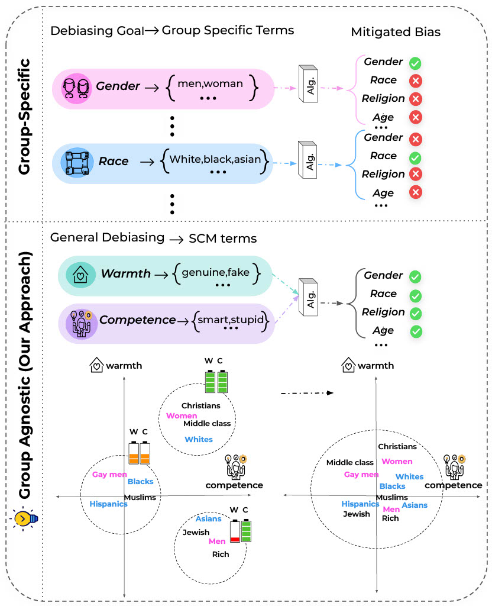

# SCM-Debiasing-ACL2023

Source code for **[Social-Group-Agnostic Bias Mitigation via the Stereotype Content Model](https://aclanthology.org/2023.acl-long.227/)** publishet at ACL 2023.

# Overview

Existing bias mitigation methods require social-group-specific word pairs (e.g., "man" -- "woman") for each social attribute (e.g., gender), restricting the bias mitigation to only one specified social attribute. In this work,  we introduce an alternative approach driven by social psychological theories of stereotyping. Specifically, we propose that the Stereotype Content Model (SCM) - a theoretical framework developed in social psychology for understanding the content of stereotyping - can help debiasing efforts to become social-group-agnostic by capturing the underlying connection between bias and stereotypes. Our experiment show that SCM-based debiasing technique performs comparably to group-specific debiasing on multiple bias benchmarks, but has theoretical and practical advantages over existing approaches.

<p align="center"></img></p>

We perform debiasing with established methods on both pre-trained word embeddings and large language models:

1. **Static Word Embedding Experiments** (Section 3)
2. **Contextualized Word Embedding Experiments** (Section 4)

Each part has their own `README` which guide you to run the experiments.

# Citations

Please cite the following paper if you find the code helpful for your research.

```bibtex
@inproceedings{omrani-etal-2023-social,
    title = "Social-Group-Agnostic Bias Mitigation via the Stereotype Content Model",
    author = "Omrani, Ali  and
      Salkhordeh Ziabari, Alireza  and
      Yu, Charles  and
      Golazizian, Preni  and
      Kennedy, Brendan  and
      Atari, Mohammad  and
      Ji, Heng  and
      Dehghani, Morteza",
    booktitle = "Proceedings of the 61st Annual Meeting of the Association for Computational Linguistics (Volume 1: Long Papers)",
    month = jul,
    year = "2023",
    address = "Toronto, Canada",
    publisher = "Association for Computational Linguistics",
    url = "https://aclanthology.org/2023.acl-long.227",
    pages = "4123--4139",
}
```
